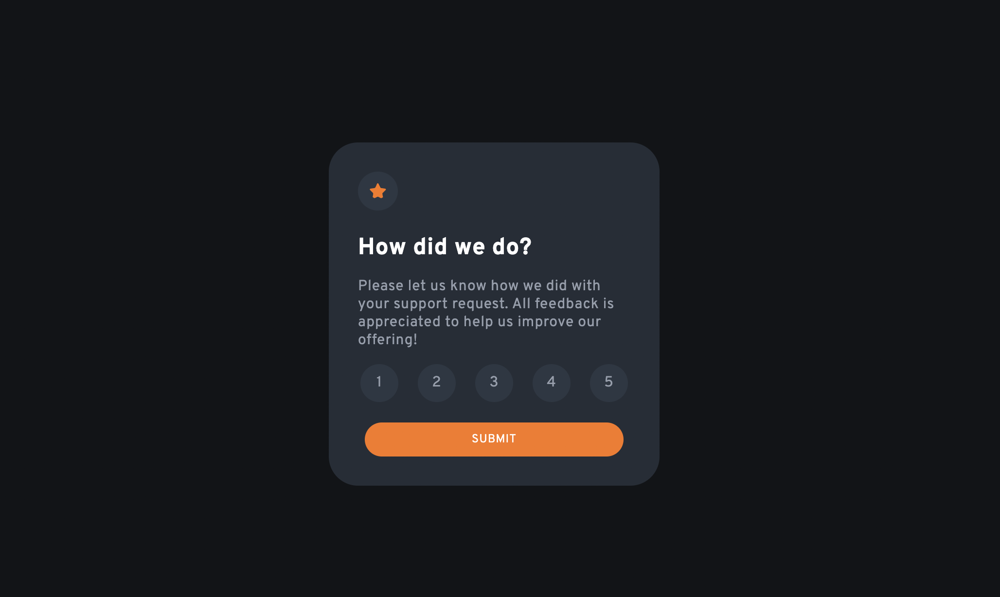

# Frontend Mentor - Interactive rating component solution

This is a solution to the [Interactive rating component challenge on Frontend Mentor](https://www.frontendmentor.io/challenges/interactive-rating-component-koxpeBUmI). Frontend Mentor challenges help you improve your coding skills by building realistic projects. 

**Follow the construction process on the TRELLO platform** https://trello.com/b/CNmpJsVg/interactive-rating-component

## Table of contents

- [Overview](#overview)
  - [The challenge](#the-challenge)
  - [Screenshot](#screenshot)
  - [Links](#links)
- [My process](#my-process)
  - [Built with](#built-with)
  - [What I learned](#what-i-learned)
  - [Continued development](#continued-development)
- [Author](#author)
- [Acknowledgments](#acknowledgments)

## Overview

### The challenge

Users should be able to:

- View the optimal layout for the app depending on their device's screen size
- See hover states for all interactive elements on the page
- Select and submit a number rating
- See the "Thank you" card state after submitting a rating

### Screenshot

### Links

- Solution URL: [Add solution URL here]

## My process
**Follow the construction process on the TRELLO platform** https://trello.com/b/CNmpJsVg/interactive-rating-component
### Built with

- Semantic HTML5 markup
- CSS custom properties

### Continued development

## Author

- LinkedIn - [Erica de Bem](https://www.linkedin.com/in/ericadebem/)

## Acknowledgments

inspiration: **Milena Emmert** (https://github.com/milenaemmert)
and Gabriel Rocha (https://github.com/rochagbriel)

